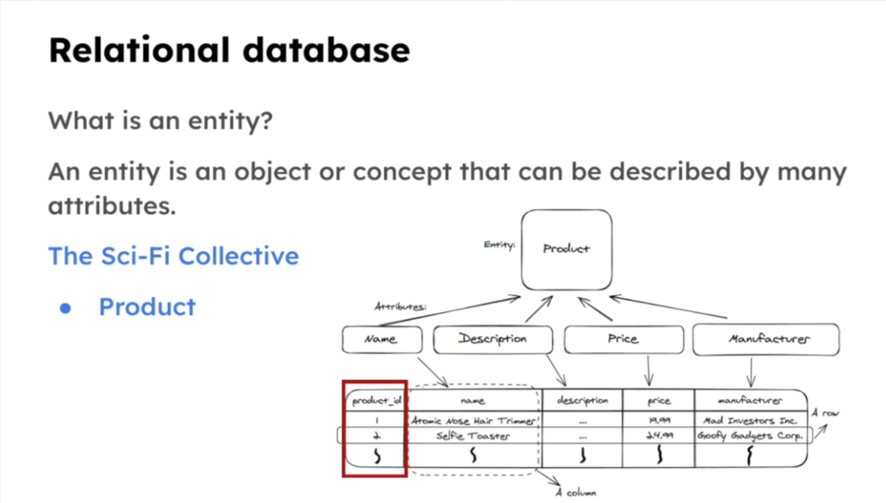
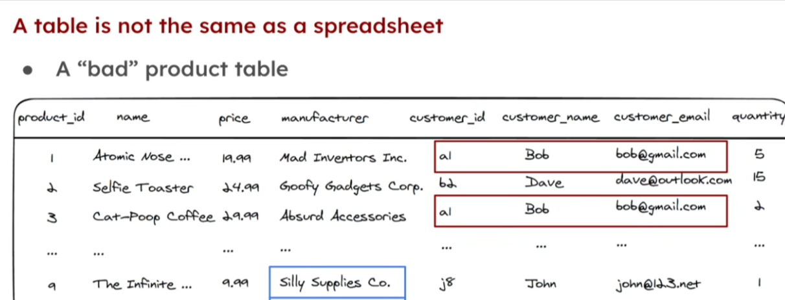

## Relational Database

Simply put, A **relational database** is a collection of tables.

A **relational database** is a type of database that organizes data into structured **tables** (relations) with defined relationships between them. It uses **SQL** (Structured Query Language) to query and manage data.

Key characteristics:

- Data is stored in tables with rows and columns
- Tables can relate to each other via **keys**
- Enforces data integrity through constraints
- Examples: PostgreSQL, MySQL, SQLite, SQL Server

---

### Tables

A **table** is similar to a spreadsheet where data is organised into rows and columns.

But A **table** is not a spreadsheet, It goes beyond that, A **table** is used to represent an entity or the relationship between entities.

A **table** is the fundamental unit of storage in a relational database. It consists of:

| Concept                | Description                                                  |
| ---------------------- | ------------------------------------------------------------ |
| **Column (field)**     | Defines the data type and name (e.g., `id`, `name`, `email`) |
| **Row (record/tuple)** | A single entry of data                                       |
| **Primary Key**        | Uniquely identifies each row (e.g., `id`)                    |
| **Foreign Key**        | A column that references a primary key in another table      |

---

### Example

```sql
-- Users table
id | name  | email
---|-------|-------------------
1  | Alice | alice@example.com
2  | Bob   | bob@example.com

-- Posts table (foreign key: user_id → users.id)
id | user_id | title
---|---------|------------
1  | 1       | "Hello World"
2  | 1       | "My Second Post"
```

---



User: what are relational databases and tables

GitHub Copilot: Optimizing tool selection...Optimizing tool selection...## Relational Databases & Tables

### Relational Database

A **relational database** is a type of database that organizes data into structured **tables** (relations) with defined relationships between them. It uses **SQL** (Structured Query Language) to query and manage data.

Key characteristics:

- Data is stored in tables with rows and columns
- Tables can relate to each other via **keys**
- Enforces data integrity through constraints
- Examples: PostgreSQL, MySQL, SQLite, SQL Server

---

### Tables

A **table** is the fundamental unit of storage in a relational database. It consists of:

| Concept                | Description                                                  |
| ---------------------- | ------------------------------------------------------------ |
| **Column (field)**     | Defines the data type and name (e.g., `id`, `name`, `email`) |
| **Row (record/tuple)** | A single entry of data                                       |
| **Primary Key**        | Uniquely identifies each row (e.g., `id`)                    |
| **Foreign Key**        | A column that references a primary key in another table      |

---

### Example

```sql
-- Users table
id | name  | email
---|-------|-------------------
1  | Alice | alice@example.com
2  | Bob   | bob@example.com

-- Posts table (foreign key: user_id → users.id)
id | user_id | title
---|---------|------------
1  | 1       | "Hello World"
2  | 1       | "My Second Post"
```

---

User: what are relational databases and tables

GitHub Copilot: Optimizing tool selection...Optimizing tool selection...## Relational Databases & Tables

### Relational Database

A **relational database** is a type of database that organizes data into structured **tables** (relations) with defined relationships between them. It uses **SQL** (Structured Query Language) to query and manage data.

Key characteristics:

- Data is stored in tables with rows and columns
- Tables can relate to each other via **keys**
- Enforces data integrity through constraints
- Examples: PostgreSQL, MySQL, SQLite, SQL Server

---

### Tables

A **table** is the fundamental unit of storage in a relational database. It consists of:

| Concept                | Description                                                  |
| ---------------------- | ------------------------------------------------------------ |
| **Column (field)**     | Defines the data type and name (e.g., `id`, `name`, `email`) |
| **Row (record/tuple)** | A single entry of data                                       |
| **Primary Key**        | Uniquely identifies each row (e.g., `id`)                    |
| **Foreign Key**        | A column that references a primary key in another table      |

---

### Example

```sql
-- Users table
id | name  | email
---|-------|-------------------
1  | Alice | alice@example.com
2  | Bob   | bob@example.com

-- Posts table (foreign key: user_id → users.id)
id | user_id | title
---|---------|------------
1  | 1       | "Hello World"
2  | 1       | "My Second Post"
```

---

## Entity in a Relational Database

An **entity** is a real-world object, person, place, or concept that has data worth storing in a database. It becomes a **table** in a relational database.

So in database models, we have something such as: **Users**(entity) table, **Product**(entity) table, **Order**(entity) table, **OrderItem**(entity) table, **Category**(entity) table, etc.

In the **Data entry (Rows)** section,in the tables, we can now establish **relationships** between the **entities**.

e.g. Which **user** created which **order**? Which **product** is in which **order**?

---

---

### Entity → Table Mapping

| Real World         | Database |
| ------------------ | -------- |
| Entity             | Table    |
| Attribute          | Column   |
| Instance of entity | Row      |

---

### Example

**Entity: `User`**

- Has attributes: `id`, `name`, `email`, `created_at`
- Each real user (e.g. _Alice_) = one **row** in the table

```
users table
┌────┬───────┬───────────────────┬─────────────┐
│ id │ name  │ email             │ created_at  │
├────┼───────┼───────────────────┼─────────────┤
│ 1  │ Alice │ alice@example.com │ 2026-01-01  │
│ 2  │ Bob   │ bob@example.com   │ 2026-01-05  │
└────┴───────┴───────────────────┴─────────────┘
```

---

### Types of Entities

- **Strong Entity** — exists independently (e.g. `User`, `Product`)
- **Weak Entity** — depends on another entity to exist (e.g. `OrderItem` depends on `Order`)

---

### In Your Project

In schema.ts, your **`articles`** table represents an `Article` entity — with attributes like `id`, `title`, `content`, `authorId`, etc. Each blog post a user creates is one instance (row) of that entity.

## What is an Entity?

An **entity** is an object or concept from the real world that can be described by many **attributes**. In a relational database, an entity becomes a **table**.

---

### Breaking It Down

```
Entity: Product
       │
       ├── Name
       ├── Description
       ├── Price
       └── Manufacturer
```

The **Product** entity has 4 attributes — these become the **columns** of a table:

| product_id | name                     | description | price | manufacturer        |
| ---------- | ------------------------ | ----------- | ----- | ------------------- |
| 1          | Atomic Nose Hair Trimmer | ...         | 19.99 | Mad Investors Inc.  |
| 2          | Selfie Toaster           | ...         | 24.99 | Goofy Gadgets Corp. |
| 3          | ...                      | ...         | ...   | ...                 |

---

### Key Concepts from the Diagram

| Term                     | What it maps to | Example                      |
| ------------------------ | --------------- | ---------------------------- |
| **Entity**               | Table           | `Product`                    |
| **Attribute**            | Column          | `name`, `price`              |
| **Instance**             | Row             | _Selfie Toaster_ entry       |
| **product_id** (red box) | Primary Key     | Uniquely identifies each row |

---

### In Plain Terms

> If "Product" is the **entity**, then a specific product like _"Selfie Toaster"_ is an **instance** of that entity — stored as a single **row** in the table.

### A Table should represent a single entity

**Key Note:** A Table can only represent a single entity or a relationship between entities.

---


